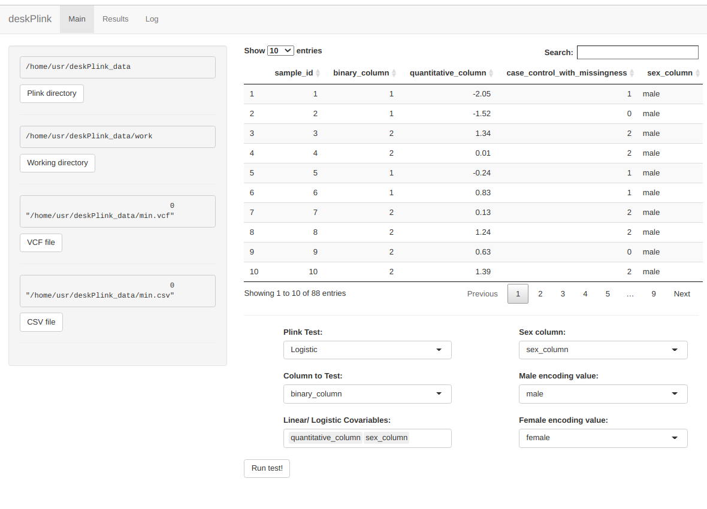

# deskPlink: Easy Testing Pheno-Geno Associations

A [RStudio Shiny](https://shiny.rstudio.com/) Graphical User Interface (GUI) is
available by calling the function `deskPlink::run()`. This enables users to
input a VCF-formatted file (genetic information) and a table as comma separated
values (CSV), with quantitative and/ or categorical variables as columns and
rows matching each of the samples. Names in VCF and CSV need to match
`1:1`. PLINK is a variant association analysis toolset, designed to perform a
range of basic, large-scale analyses in a computationally efficient manner. For
more information please refer to upstream
[documentation](https://www.cog-genomics.org/plink).



## Installation

```{r}
require(devtools)
install_github("adRn-s/deskPlink")
```
